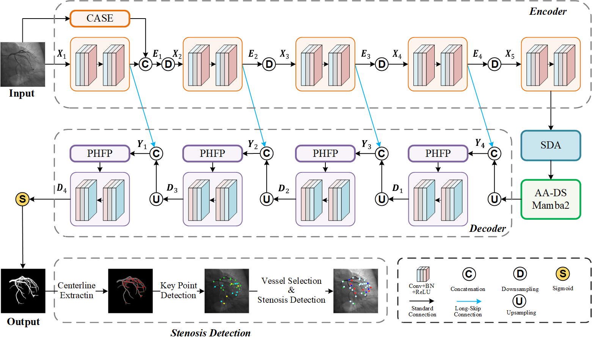
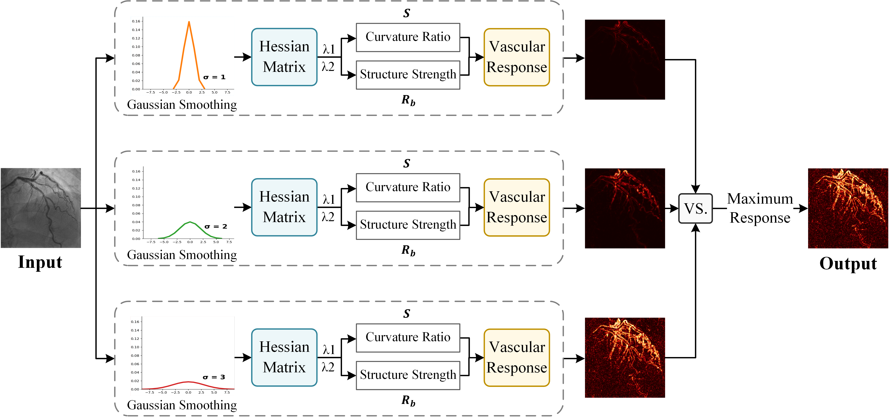
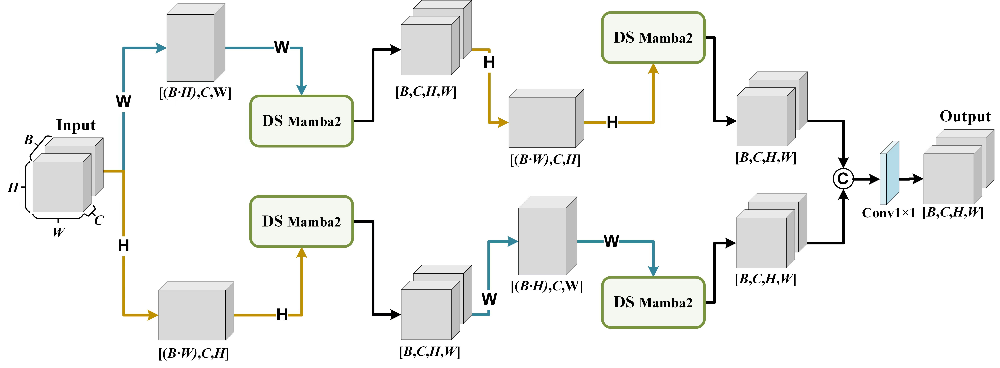
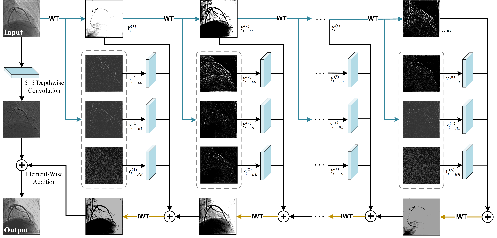

# Structure-Guided Frequency-Enhanced Dual-Stream Mamba2 Network（SFD-Mamba2Net）

## Architecture Overview



The overall architecture of SFD-Mamba2Net is an asymmetric encoder–decoder framework,  which integrates multiple innovative structural modules to improve performance in medical image segmentation tasks:

**CASE** (Curvature-Aware Structural Enhancement Module): Captures multi-scale structural priors from the input image, enhancing vascular continuity and improving robustness to noise.


**AA-DS Mamba2** (Axial-Alternating Dual-Stream Mamba2 Module)：Embedded at the encoder bottleneck to capture long-range dependencies and construct condition-aware attention for vessel–background decoupling.


**PHFP** (Progressive High-Frequency Perception Module)：Enhances skip connections during decoding, progressively refining and propagating multi-scale features.


This network is particularly well-suited for vascular segmentation and stenosis detection, effectively preserving fine structural continuity and improving robustness against background interference.

---

## Modules Explained

### CBL  
A standard convolution module comprising two combinations of Conv2d + BatchNorm + Dropout + LeakyReLU.

### Downsample / Upsample  
Downsample: Uses convolution with stride=2 for spatial compression.  
Upsample: Employs nearest neighbor interpolation upsampling followed by concatenation with encoder feature maps.  

### CASE (Curvature-Aware Structural Enhancement)
CASE is located in the shallow layers of the encoder and is used to provide geometric priors of vessels while capturing curved and elongated vascular structures. It leverages multi-scale responses to highlight regions with local curvature variations, guiding the network to focus on the main vessels while suppressing background noise. This module enhances the continuity of vascular structures and improves the model's robustness to noise.

### AA-DS Mamba2 (Axial-Alternating Dual-Stream Mamba2)
AA-DS Mamba2 is positioned at the bottleneck between the encoder and decoder and is designed to capture global spatial dependencies of complex vascular structures. It employs horizontal and vertical dual pathways along with forward and backward parallel Mamba2 sequences, combined with the Structured State Space Duality (SSD) framework, to efficiently model long-range spatial dependencies. This module enhances the representation of complex vascular topologies and fine branches, improving the continuity of vessel bifurcations and micro-branches while avoiding structural fragmentation.

### PHFP (Progressive High-Frequency Perception)
PHFP is located in the decoder and is used to enhance high-frequency details while preserving low-frequency global structures for multi-scale reconstruction of vessels. It progressively strengthens high-frequency sub-band features through multi-level wavelet decomposition and deep convolution, while integrating low-frequency global information. This module improves segmentation accuracy, restores fine vessel edges, and enhances the robustness of stenosis detection.

---

## Quick Start

```python
from net import SFD_Mamba2Net
import torch

model = SFD_Mamba2Net()
x = torch.randn(2, 1, 512, 512)  # Input: grayscale 
y = model(x)
print(y.shape)  # Output: [2, 1, 512, 512]
```

---

## Requirements

Below are the versions of Python packages required to run this model:

```ini
torch==2.3.1+cu118
torchvision==0.18.1+cu118
monai==1.4.0
timm==1.0.15
einops==0.8.0
matplotlib==3.9.4
scikit-learn==1.6.1
scikit-image==0.24.0
pillow==11.1.0
opencv-python==4.11.0.86
pytorch-wavelets==1.3.0
pywavelets==1.6.0
albumentations==2.0.8
nibabel==5.3.2
h5py==3.14.0
```

Installation:

```bash

pip install -r requirements.txt
```

---
## Data Structure

To ensure the project runs smoothly, please organize your data according to the following structure:

```bash

project_root/
├── dataset/
│   ├── train/
│   │   ├── source/
│   │   │   ├── images/
│   │   │   └── masks/
│   │   └── target/
│   │       ├── images/
│   │       └── masks/
│   └── test/
│       ├── images/
│       └── masks/ 
├── weight/
├── results_txt/
├── outputs/
└── ...
```

---
## Code Structure

```bash

.
├── data.py
├── net.py           
├── CASE.py          
├── AA_DSMamba2.py  
├── PHFP.py 
├── README.md
└── ...
```

---

## Citations

If this project is helpful to your research, please cite this repository or the related methods.

```latex
@misc{NanSDFMamba2ICA,
  title={SFD_Mamba2Net:Structure-Guided Frequency-Enhanced Dual-Stream Mamba2 Network for Coronary Artery Segmentation using Invasive Coronary Angiography},
  author={Nan Mu, Ruiqi Song, Zhihui Xu, Jingfeng Jiang, Chen Zhao},
  year={2025},
  note={\url{https://github.com/chenzhao2023/SFD_Mamba2Net_ICA_BinarySeg}}
}
```
